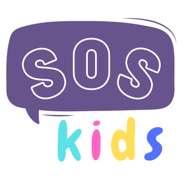

## Project - Hacks for Humanity Hackathon
Kids often face a variety of challenges, such as anxiety, depression, and even abuse, when involved in competitive sports. Our web app is designed to provide mental health resources to help children identify and deal with these issues. 

## Contributors
Jessica Cassidy \
Crissel Ignacio \
Helena Makendengue \
Laila Masoud \
Michel Nzihou 

## Build
- Python
- Django
- Vanilla HTML/CSS

## **Getting Started**
* Clone repository

      $ git clone https://github.com/cassjs/venture-insight.git
    
* Navigate to the project folder

      $ cd venture-insight
      
* Create Virtual Environnment

      # conda
      $ conda create -n myenv python=3.8
      
      # Windows
      $ python -m venv myenv
      
      # Mac / Unix / WSL
      $ virtualenv env

* Activate Virtual Environnment

      #conda
      $ conda activate myenv
      
      # Windows
      $ myenv/scripts/activate
      
      # Mac / Unix / WSL
      $ source env/bin/activate
      
* Install requirements.txt

      $ pip install -r requirements.txt
      
* Run Application

      $ ./runserver.sh
